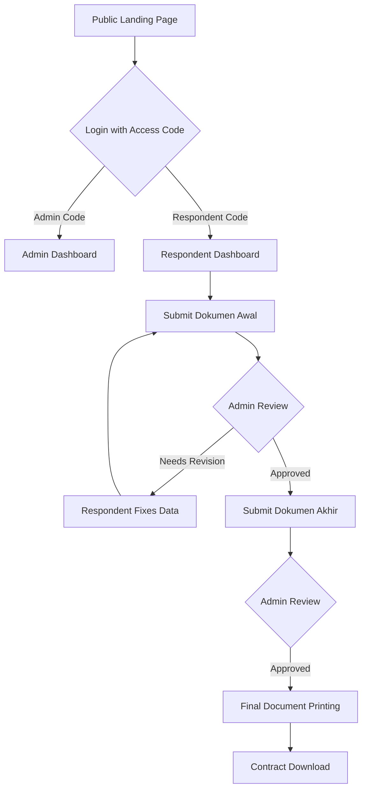
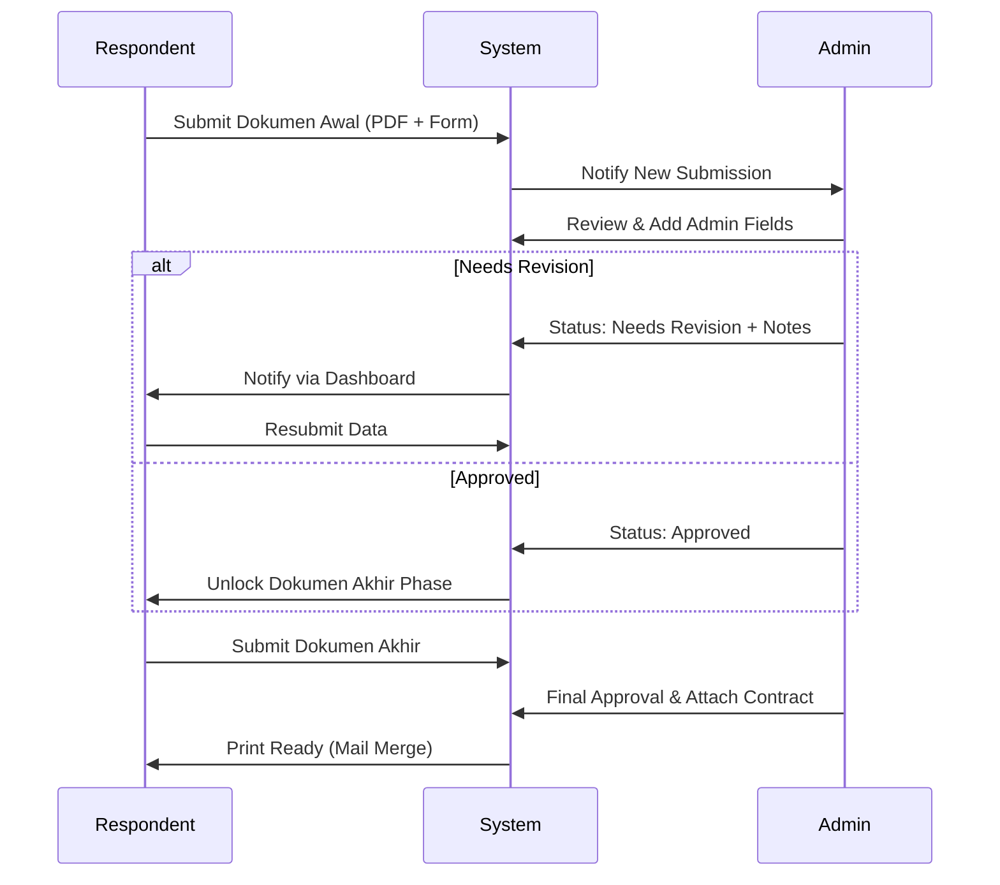

# PUSDAOP: Government Document Operations Portal
## Sistem Arsitektur & Alur Kerja

### 1. Alur Utama (System Flow)

### 2. Sequence Diagram: Submission Workflow

### 3. Panduan Langkah-demi-Langkah
1. **Akses**: Masuk menggunakan kode akses yang diberikan admin.
2. **Pengajuan Awal**: Isi data kontrak dan unggah profil perusahaan.
3. **Verifikasi**: Admin memeriksa kelengkapan data.
4. **Pengajuan Akhir**: Setelah disetujui, lengkapi data teknis/pelaksanaan.
5. **Cetak**: Unduh dokumen format pemerintah (BAPHP, BAST) yang sudah terisi otomatis.

### 4. Referensi Status
- **Draft**: Belum dikirim.
- **Submitted**: Menunggu antrean review.
- **Under Review**: Sedang diperiksa admin.
- **Approved**: Data valid, lanjut ke tahap berikutnya.
- **Needs Revision**: Ada kesalahan, cek catatan admin.
- **Rejected**: Pengajuan ditolak.